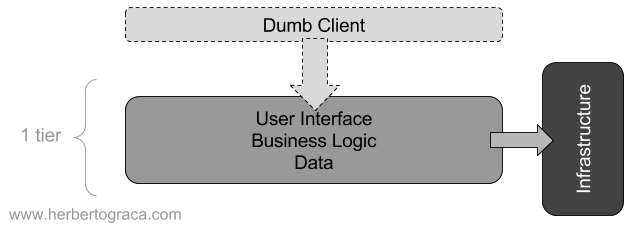
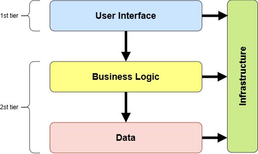
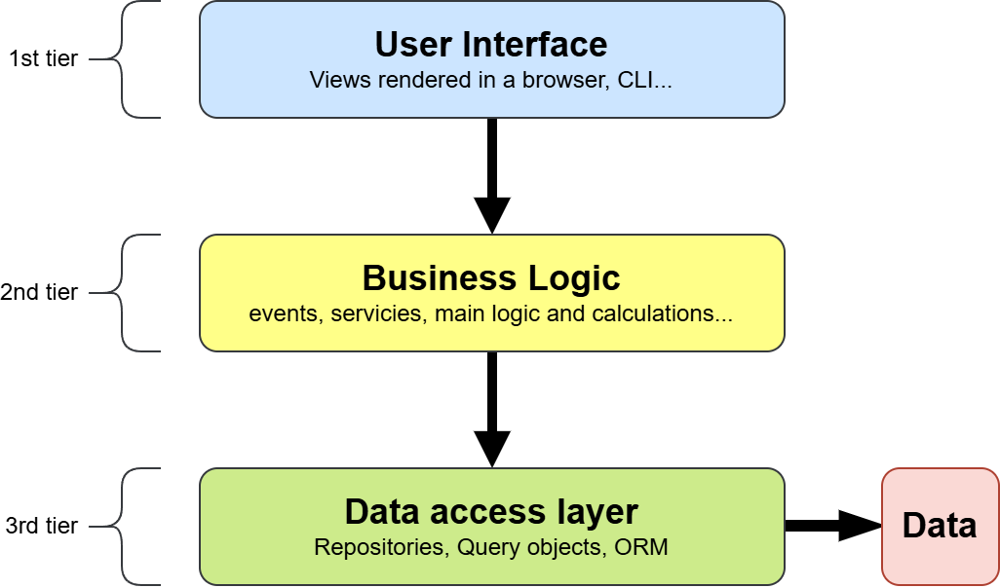
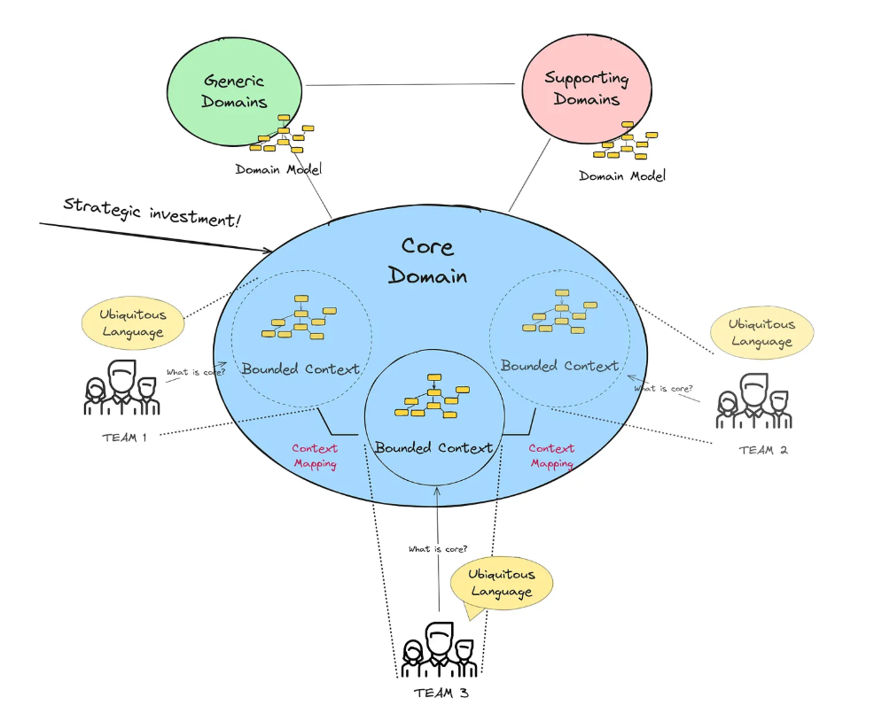
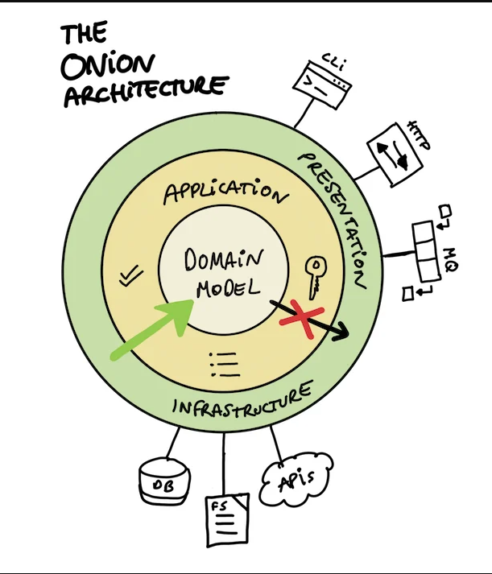
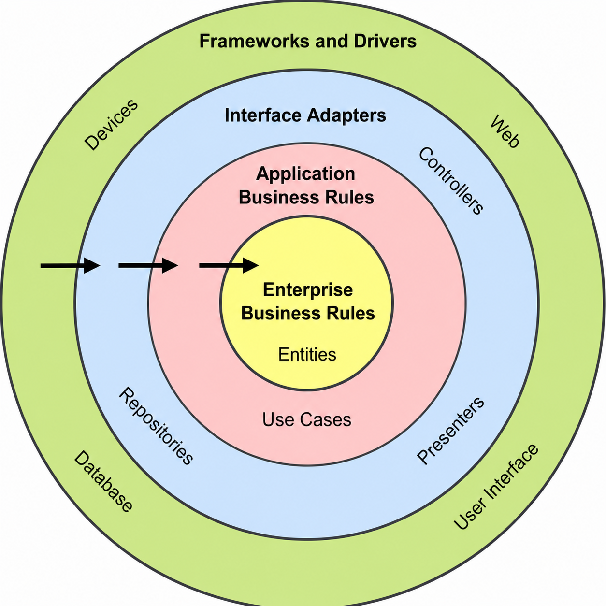
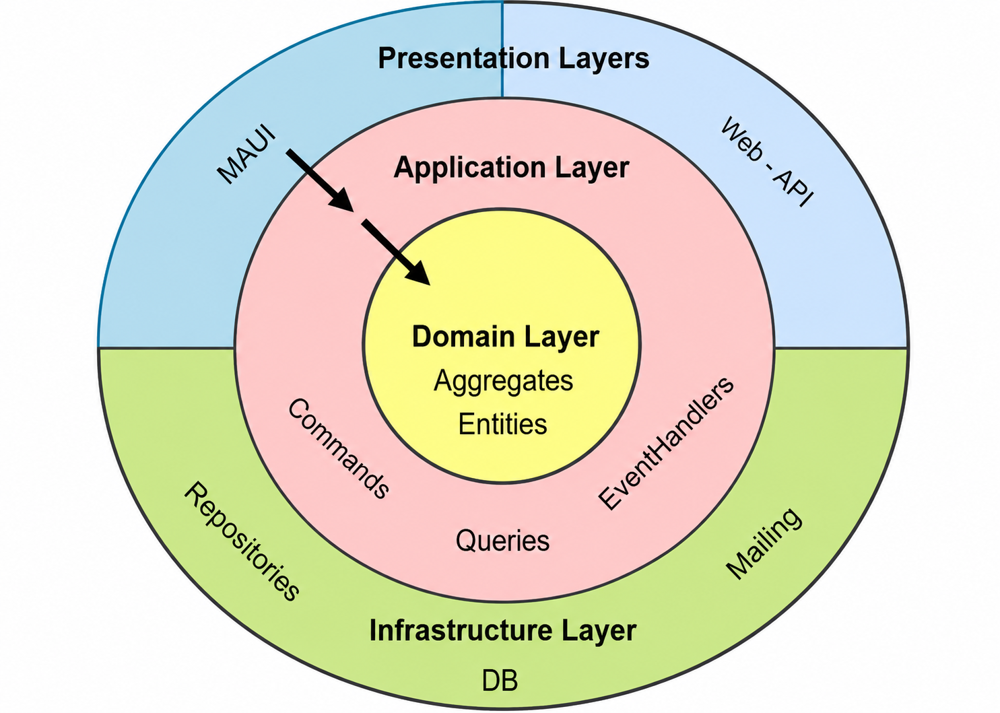
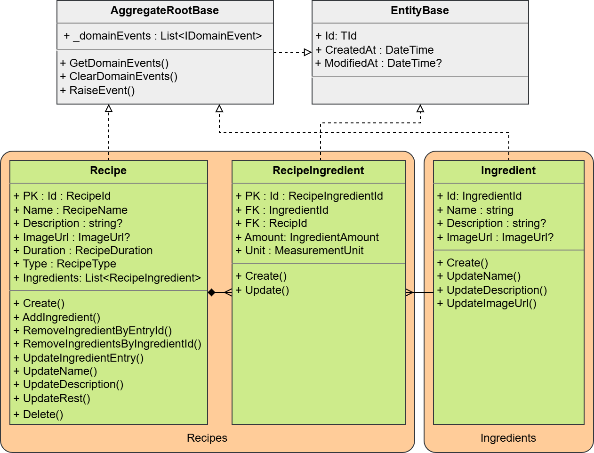

# Architectures

## Introduction to Clean Architecture

<div class="right">[ Jan Pluskal &lt;pluskal@vut.cz&gt;  ]</div>

---

## Lecture Outline
1. Essential .NET library concepts
2. Software frameworks and architectures
3. Evolution of layered architectures
4. Clean Architecture
5. The Domain layer and its patterns

---

## Essential .NET toolbox

The **Base Class Library (BCL)** provides reusable types for common work:

- collections and text;
- files, streams and networking;
- dates, numbers and regular expressions;
- tasks, cancellation and diagnostics.

Learn how to find and combine these types. You do not need to memorize every API.

+++

### Namespaces, assemblies and packages

```csharp
using System;
using System.Collections.Generic;
using System.IO;
```

- A **namespace** groups related types.
- An **assembly** is a compiled deployment unit.
- A **NuGet package** distributes one or more assemblies.

+++

### Generic collections

Generic collections store one declared type and check it at compile time.

| Need | Typical type |
|---|---|
| Ordered sequence | `List<T>` |
| Last in, first out | `Stack<T>` |
| First in, first out | `Queue<T>` |
| Lookup by key | `Dictionary<TKey, TValue>` |
| Sorted lookup by key | `SortedList<TKey, TValue>` |
| Unique values | `HashSet<T>` |

Prefer generic collections over `ArrayList`, `Hashtable`, `Stack` and `Queue` from `System.Collections`.

+++

### Generic list

`List<T>` is a variable-size, indexable sequence.

```csharp
var numbers = new List<int> { 2, 3, 5, 7 };

numbers.Add(11);
numbers.AddRange([13, 17]);

bool containsFive = numbers.Contains(5);
int first = numbers[0];
```

All elements must be compatible with `T`. No cast or boxing is required for value types.

+++

### Generic stack

`Stack<T>` processes the most recently added item first: **last in, first out**.

```csharp
var history = new Stack<string>();

history.Push("open recipe");
history.Push("edit name");
history.Push("change duration");

string latest = history.Peek(); // change duration
string undo = history.Pop();    // change duration
```

Typical uses include undo history, parsing and depth-first traversal.

+++

### Generic queue

`Queue<T>` processes the earliest added item first: **first in, first out**.

```csharp
var jobs = new Queue<string>();

jobs.Enqueue("resize image");
jobs.Enqueue("save recipe");
jobs.Enqueue("send notification");

string next = jobs.Peek();    // resize image
string job = jobs.Dequeue();  // resize image
```

Queues fit ordered work, buffering and breadth-first traversal.

+++

### Dictionary and sorted list

```csharp
var units = new Dictionary<string, string>
{
    ["g"] = "gram",
    ["ml"] = "millilitre"
};

var steps = new SortedList<int, string>
{
    [20] = "Bake",
    [10] = "Prepare"
};
```

`Dictionary<TKey, TValue>` provides fast lookup by key. `SortedList<TKey, TValue>` keeps entries ordered by key.

+++

### Sets and collection interfaces

```csharp
var tags = new HashSet<string>(StringComparer.OrdinalIgnoreCase)
{
    "quick", "vegetarian", "Quick"
};

IReadOnlyCollection<string> visibleTags = tags;
```

- `HashSet<T>` stores unique values.
- `IEnumerable<T>` supports iteration.
- `IReadOnlyCollection<T>` adds a count without exposing mutation.
- Accept the least powerful interface that the caller needs.

+++

### Resources have a lifetime

Files, streams and database connections must eventually be released.

```csharp
using var stream = File.OpenRead("recipes.json");
using var reader = new StreamReader(stream);

var content = await reader.ReadToEndAsync();
```

`using` guarantees cleanup through `IDisposable`, including when an operation fails.

---

# Software Architectures

---

## Basic Terms
 <!-- .element: class="overview" -->
* **Software framework**
* **Software architecture**
  * Architectural patterns and styles
  * Layers and tiers
  * Monoliths and distributed systems
  * Domain and infrastructure

---

## Software Framework
* **Abstraction** providing **generic functionality**
* Can be selectively changed by additional user-written code
  * Providing application-specific software
* **Universal, reusable software environment**
  * Provides particular functionality as part of a larger software platform
    * To facilitate development of software applications

---

## Software Architectures
- There are many recognized architectural patterns and styles, among them:
  - Client-server (2-tier, 3-tier, n-tier, cloud computing exhibit this style)
  - Component-based
  - Data-centric
  - Event-driven (or implicit invocation)
  - **Layered (or multilayered architecture)**
  - Microservices architecture
  - **Monolithic application**
  - Pipes and filters
  - Plug-ins
  - Reactive architecture
  - Representational state transfer (REST)
  - Service-oriented
  - Serverless architecture
  - Hexagonal architecture (Ports and Adapters)
  - Onion Architecture
  - **Clean Architecture**

+++

### Layered (or multilayered architecture)

- In a layered system, each layer:
  - **Depends** on the layers beneath it;
  - Is **independent** of the layers on top of it, having no knowledge of the layers using it.

- The **advantages** are:
  - We only need to *understand the layers beneath* the one we are working on;
  - *Each layer is replaceable* by an equivalent implementation, with no impact on the other layers;
  - Layers are optimal candidates for standardisation;
  - A layer can be used by several different higher-level layers.

- The **disadvantages** are:
  - Layers cannot encapsulate everything (a field that is added to the UI, most likely also needs to be added to the DB);
  - Extra layers can harm performance, especially if in different tiers.

[Section source - read more](https://herbertograca.com/2017/08/03/layered-architecture/)

+++

### The 60s and 70s - 1 tier

- Applications were simple and difficult to scale.
- Users worked through a command-line interface on a terminal.
- The application and its data ran on the same computer.
- Most applications served a single user.

 <!-- .element: class="r-stretch" -->

+++

### From one tier to two tiers

- During the 1980s and 1990s, client-server systems separated the client from shared infrastructure.
- Applications accessed shared data through the network.
- One server could support multiple users.

 <!-- .element: class="r-stretch" -->

+++

### Layering after the mid 90s - 3 tier / n-tier

- The user interface runs on a client or in a browser.
- Business logic runs on an application server.
- Data lives behind a separate data-access boundary.

 <!-- .element: class="r-stretch" -->

+++

### The traditional three layers

- **User Interface (Presentation)**
  - Receives input and presents output.
  - Calls operations offered by the business layer.
- **Business Logic (Domain)**
  - Implements application behavior and business rules.
  - Coordinates work required by a request.
- **Data Access**
  - Loads and stores data.
  - Contains repositories, queries and ORM-specific code.

Dependencies and calls normally point from the UI toward the data-access layer.

+++

### Layering after the early 2000s - DDD

 <!-- .element: class="architecture-diagram ddd-history-diagram" -->

+++

### Domain-Driven Design

**Domain-Driven Design (DDD)** is a design approach introduced by Eric Evans in 2003.

- The **domain** is the real-world problem area addressed by the software.
- A **domain model** expresses its important concepts, behavior, rules and relationships.
- Developers and domain experts build a shared **ubiquitous language**.
- The model aims to represent business behavior, not merely database structure.

DDD does not prescribe one application architecture.

Note:
[Sources]
- Adam Varsányi, Migrace technologického kurzu ICS na Clean Architecture, section 3.4.
- Eric Evans, Domain-Driven Design, 2003.

+++

### Architectures commonly paired with DDD

- **Hexagonal Architecture (2005)** isolates the application behind ports and adapters.
- **Onion Architecture (2008)** places the Domain Model at the center.
- **Clean Architecture (2012)** separates enterprise rules, use cases, adapters and technical details.

They share an inside-outside boundary and protect business rules from infrastructure.

+++

### Onion Architecture

<div class="architecture-split onion-split">
  <div class="architecture-visual">
    
  </div>
  <div class="architecture-copy">
    <p>Jeffrey Palermo introduced Onion Architecture in <strong>2008</strong>.</p>
    <ul>
      <li>The application is built around an <strong>independent Domain Model</strong>.</li>
      <li>Dependencies point <strong>toward the center</strong>. Outer layers implement interfaces defined by inner layers.</li>
    </ul>
  </div>
</div>

Note:
[Sources]
- Jeffrey Palermo, The Onion Architecture: part 1, 2008: https://jeffreypalermo.com/2008/07/the-onion-architecture-part-1/
- Diagram supplied with the lecture materials.

+++

## Clean Architecture

 <!-- .element: class="architecture-diagram clean-martin-diagram" -->

+++

### Clean Architecture layers

- **Domain / Entities**
  - Stable enterprise or domain-wide business rules.
- **Application / Use Cases**
  - Application-specific workflows that orchestrate the Domain.
- **Interface Adapters**
  - Controllers, presenters, repository implementations and data conversion.
- **Frameworks and Drivers**
  - UI frameworks, databases, devices and external services.

All source-code dependencies point toward the center.

Note:
[Sources]
- Robert C. Martin, The Clean Architecture, 2012: https://blog.cleancoder.com/uncle-bob/2012/08/13/the-clean-architecture.html
- Adam Varsányi, thesis section 3.3.

+++

### Clean Architecture is a family of designs

The original diagram is explanatory, not a mandatory folder structure.

A project may:

- use three projects or many projects;
- combine interface adapters with Presentation or Infrastructure;
- place repository interfaces in Domain or Application according to who needs them;
- add a separate CQRS read model;
- organize use cases as vertical slices;
- run as a modular monolith or inside individual microservices.

Preserve the dependency rule and choose boundaries that solve the actual problem.

+++

### Anti-pattern: Lasagna Architecture

- Lasagna Architecture is the name commonly used to refer to the **anti-pattern for Layered Architecture**.
- It happens when:
  - strict layering creates proxy methods and classes only to pass through intermediate layers;
  - a search for the perfect abstraction produces **over-abstraction**;
  - small updates reverberate through the entire application;
  - too many layers increase complexity;
  - too many tiers increase complexity and damage performance;
  - the monolith is organized only by technical layers instead of domain concepts.

 <!-- .element: class="r-stretch" -->

+++

### Clean Architecture used in this course

 <!-- .element: class="architecture-diagram course-diagram" -->

This course uses a pragmatic variant with separate Domain, Application, Infrastructure and Presentation projects.

+++

### Layers in the course architecture

- **Presentation** translates user input into application requests.
- **Application** orchestrates domain objects without owning business rules.
- **Domain** contains the model, business rules, entities and events.
- **Infrastructure** supplies persistence, messaging and other technical capabilities.

+++

### Layered and Clean Architecture

| | Traditional three-layer | Clean Architecture |
|---|---|---|
| Design starting point | Often the database model | Domain model and business rules |
| Dependency direction | Top-down toward data access | Inward toward business policy |
| Database | Foundation of lower layers | Replaceable implementation detail |
| Business logic tests | Often require lower-layer substitutes | Run without UI, database or external systems |
| Technology changes | Can ripple into higher layers | Mostly affect outer layers |

Note:
[Sources]
- Adam Varsányi, thesis section 3.5, pages 28-29.

+++

### Choosing between them

**Traditional three-layer architecture**

- Easy to understand and quick to implement.
- Fits smaller systems with limited business logic and fewer integrations.
- Database changes and cross-layer requirements may cause broad refactoring.
- Pass-through layers can add needless code and runtime overhead.

**Clean Architecture**

- Improves isolation, testability and technology replacement.
- Fits larger, long-lived systems with richer business rules.
- Requires more abstractions, interfaces and architectural discipline.
- Its initial cost may not be justified for a small CRUD application.

Note:
[Sources]
- Adam Varsányi, thesis section 3.5, pages 28-29.

---

## Clean Architecture - Domain layer

### Domain model at the center

- The Domain contains the business vocabulary and state.
- Its rules remain stable when UI or persistence technology changes.

+++

### Start with the language of the problem

The CookBook domain talks about:

- recipes and ingredients;
- preparation duration and recipe type;
- ingredient amounts and measurement units;
- adding, updating and removing ingredients;
- reviews and their marks.

Good domain code uses the same vocabulary as the requirements.

Note:
[Sources]
- Adam Varsányi, Migrace technologického kurzu ICS na Clean Architecture, sections 3.4 and 5.1.
- Eric Evans, Domain-Driven Design, 2003.

+++

## Business rules are executable constraints

Examples from the current CookBook:

- a recipe name has at least three characters;
- preparation duration is positive;
- ingredient amount is positive;
- a recipe contains between one and ten ingredients;
- a review mark is between one and five.

The Domain must prevent states that violate these rules.

+++

## An entity has continuity

An **entity** is identified by its identity, not only by its current values.

```csharp
public abstract record EntityBase<TId>(TId Id)
    where TId : StronglyTypedId
{
    public DateTime CreatedAt { get; set; }
    public DateTime? ModifiedAt { get; set; }
}
```

The same recipe remains the same entity after its description changes.

+++

## Strongly typed IDs prevent mix-ups

```csharp
public record RecipeId(Guid Value) : StronglyTypedId(Value);
public record IngredientId(Guid Value) : StronglyTypedId(Value);
```

```csharp
void AddIngredient(IngredientId ingredientId) { /* ... */ }
```

Passing a `RecipeId` by mistake is now a **compile-time error**.

+++

## A value object is defined by its value

A **value object**:

- has no independent identity;
- represents one meaningful concept;
- validates its own allowed values;
- is preferably immutable;
- compares by value.

Examples: `RecipeName`, `RecipeDuration`, `IngredientAmount`, `ImageUrl`.

+++

## A value object makes invalid input explicit

```csharp
public record RecipeName
{
    public string Value { get; }

    private RecipeName(string value) => Value = value;

    public static Result<RecipeName> CreateObject(string value)
        => string.IsNullOrWhiteSpace(value) || value.Length < 3
            ? Result.Failure<RecipeName>(
                RecipeValueObjectsErrors.RecipeNameNotInvalidError())
            : Result.Success(new RecipeName(value));
}
```

+++

## Primitive versus domain type

```csharp
void ChangeName(string name)
```

What does the string contain? Has it been validated?

```csharp
void ChangeName(RecipeName name)
```

The type communicates meaning and guarantees that its creation rules passed.

+++

## An aggregate is a consistency boundary

An **aggregate** is a group of related domain objects changed as one unit.

It has exactly one public entry point: the **aggregate root**.

The root:

- protects invariants;
- controls modifications to child entities;
- is the object loaded and saved as the unit of work.

+++

## CookBook has two main aggregates

 <!-- .element: class="domain-model" -->

`Recipe` owns `RecipeIngredient` entries. `Ingredient` is a separate aggregate and is referenced by `IngredientId`.

Note:
[Sources]
- Adam Varsányi, Migrace technologického kurzu ICS na Clean Architecture, figure 5.1 and section 5.1.

+++

## The root owns changes

External code should not do this:

```csharp
recipe.Ingredients.Add(item); // not available
```

It asks the aggregate to perform a meaningful operation:

```csharp
var result = recipe.AddIngredient(ingredientId, amount, unit);
```

The method can enforce every rule involved in that change.

+++

## Expose collections as read-only

```csharp
private readonly List<RecipeIngredient> _ingredients = [];

public IReadOnlyCollection<RecipeIngredient> Ingredients
    => _ingredients.AsReadOnly();
```

Encapsulation is not only about `private` fields.

It is about controlling the operations that may change state.

+++

## Read-only collections in practice

Callers cannot edit the collection directly:

```csharp
recipe.Ingredients.Add(item);       // compile-time error
recipe.Ingredients[0] = otherItem;  // compile-time error

var copy = recipe.Ingredients.ToArray();
copy[0] = otherItem;                // changes only the copy
```

The aggregate exposes operations that preserve its rules:

```csharp
recipe.AddIngredient(ingredientId, amount, unit);
recipe.UpdateIngredientEntry(entryId, amount, unit);
recipe.RemoveIngredientByEntryId(entryId);
```

Each method can validate limits, identities and allowed values before changing the private list.

+++

## An invariant lives next to the state

```csharp
public Result RemoveIngredientByEntryId(RecipeIngredientId entryId)
{
    var index = _ingredients.FindIndex(i => i.Id == entryId);

    if (index < 0)
        return Result.Failure(/* not found */);

    if (_ingredients.Count == MinIngredients)
        return Result.Failure(/* at least one required */);

    _ingredients.RemoveAt(index);
    return Result.Success();
}
```

+++

## Factories protect object creation

```csharp
private Recipe(/* valid values */) { /* ... */ }

public static Result<Recipe> Create(
    RecipeName name,
    RecipeDuration duration,
    IReadOnlyCollection<RecipeIngredientData> ingredients)
{
    if (ingredients.Count == 0)
        return Result.Failure<Recipe>(/* error */);

    // Construct only after the initial state is valid.
}
```

A constructor can perform checks, but it cannot return `Result<Recipe>`. It must either create an object or throw.

A private constructor leaves one public creation path. The factory can validate the complete initial state, return domain errors and construct the object only after every check succeeds.

+++

## Constructor validation versus a factory

```csharp
// Public constructor: invalid input usually becomes an exception.
var recipe = new Recipe(name, duration, ingredients);

// Factory: expected validation failure is explicit.
var result = Recipe.Create(name, duration, ingredients);

if (result.IsFailure)
    return result.Error;
```

Named factories can also communicate intent, such as `CreateDraft(...)` or `Restore(...)`, while keeping constructors private.

+++

## Expected failure is not exceptional

An invalid name or a missing ingredient is a normal business outcome.

```text
Exception → “The operation could not continue unexpectedly.”
Result    → “The operation completed with success or a known failure.”
```

The CookBook uses `Result` for validation and not-found paths.

Note:
[Sources]
- Adam Varsányi, Migrace technologického kurzu ICS na Clean Architecture, Result pattern sections 3.4 and 5.1.

+++

## `Result<T>` carries one of two outcomes

```csharp
public class Result<T> : Result
{
    public T Value => IsSuccess
        ? field!
        : throw new InvalidOperationException();
}

public class Result
{
    public bool IsSuccess { get; }
    public bool IsFailure => !IsSuccess;
    public Error Error => IsFailure
        ? field!
        : throw new InvalidOperationException();
}
```

Callers must inspect the outcome before accessing its value or error.

+++

## Errors are data

```csharp
public sealed record Error
{
    public required string Code { get; init; }
    public required string Message { get; init; }
    public object[] Arguments { get; init; } = [];
}
```

An error code is stable for software. A message is useful for people.

Presentation decides how the error is displayed.

+++

## Domain events record meaningful facts

```csharp
public Result UpdateName(RecipeName newName)
{
    if (Name != newName)
    {
        RaiseEvent(new RecipeNameUpdatedEvent(Id, Name.Value, newName.Value));
        Name = newName;
    }

    return Result.Success();
}
```

The Domain records **what happened**. Application and Infrastructure decide what happens next.

Detailed event processing comes in lecture 07.

+++

## Organize by domain concept

```text
Domain/
├── Ingredients/
│   ├── Errors/
│   ├── ValueObjects/
│   └── Ingredient.cs
├── Recipes/
│   ├── Errors/
│   ├── Events/
│   ├── ValueObjects/
│   ├── Recipe.cs
│   └── RecipeIngredient.cs
└── Shared/
```

Related behavior stays close to the vocabulary it implements.

+++

## Domain tests read like rules

```csharp
[Fact]
public void Creating_Recipe_Without_Ingredients_Should_ReturnFailure()
{
    var result = Recipe.Create(
        validName,
        validDescription,
        imageUrl: null,
        validDuration,
        RecipeType.Drink,
        ingredients: []);

    Assert.True(result.IsFailure);
}
```

No mock database is required because the rule belongs to the Domain.

+++

## A useful modeling sequence

1. Write the requirements in domain language.
2. Identify identities and value-like concepts.
3. Group objects that must stay consistent together.
4. Choose an aggregate root for each group.
5. Put state changes behind meaningful methods.
6. Return explicit failures when a rule rejects an operation.
7. Test each invariant in memory.

+++

## Your first project milestone

Implement the Domain before choosing a database or UI:

- aggregates and entities;
- value objects and strongly typed IDs;
- creation and update methods;
- domain errors and `Result` values;
- tests for valid and invalid operations.

The project should compile and its Domain tests should run independently.

**Testing follows next week.** Lecture 04 covers clean-code practices and shows how to test these domain rules.

---

## Check your understanding

1. Why is `IngredientId` safer than `Guid`?
2. Why is `Recipe.Ingredients` read-only outside `Recipe`?
3. Why should ingredient changes go through methods on the `Recipe` aggregate root?
4. What is the difference between an entity and a value object?
5. Is Clean Architecture automatically better for every application?

---

## The main idea

The database, UI and frameworks matter—but they do not define the CookBook.

The enduring part is the language and behavior of recipes and ingredients.

> Model the rules first. Attach technical details (database) afterward.

---

## References and further reading

- Milan Jovanović, [**The Beginner's Guide to Clean Architecture**](https://youtu.be/TQdLgzVk2T8?si=rTar0PI-i6nP2eWu).
- Robert C. Martin, *Clean Architecture*, 2017.
- Eric Evans, *Domain-Driven Design*, 2003.
- Alistair Cockburn, [Hexagonal Architecture](https://alistair.cockburn.us/hexagonal-architecture), 2005.
- Jeffrey Palermo, [The Onion Architecture](https://jeffreypalermo.com/2008/07/the-onion-architecture-part-1/), 2008.
- Robert C. Martin, [The Clean Architecture](https://blog.cleancoder.com/uncle-bob/2012/08/13/the-clean-architecture.html), 2012.
- Microsoft, [.NET class library overview](https://learn.microsoft.com/dotnet/standard/class-library-overview).
- Microsoft, [Domain model structure](https://learn.microsoft.com/dotnet/architecture/microservices/microservice-ddd-cqrs-patterns/microservice-domain-model).
- Adam Varsányi, *Migrace technologického kurzu ICS na Clean Architecture*, 2026.
